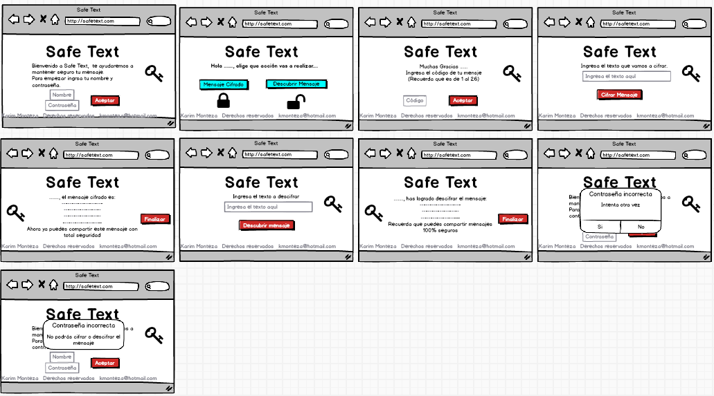

# Safe Text

## Índice

- [Índice](#índice)
- [Introducción](#introducción)
- [Investigación UX](#invvestigación-ux)
- [Prototipo de papel](#prototipo-de-papel)
- [Feedback](#feedback)
- [Prototipo Balsamiq](#prototipo-balsamiq)

## Introducción

Para nuestros clientes lo más importante es la seguridad de sus datos personales y confidenciales, por ello no debe caer en manos de personas equivocadas y **Safe Text** busca proteger esos datos sensibles con un mensaje encriptado siendo descifrado por la persona correcta o viceversa

## Investigación UX

Para este proyecto se entrevistó a 5 usuarios  a quienes se les hizo la pregunta: ¿Por qué ellos usarían un mensaje encriptado?  La conclusión:
Los Usuarios de Safe Text son personas entre 25 a 65 años de edad, quienes buscan proteger sus datos personales( usuarios y claves, datos de clientes, mensajes secretos,  números de tarjetas, etc), ellos envían muchas veces mensajes totalmente confidenciales a través del internet: correo y aplicativos como whatsapp, messenger, entre otros. Este mensaje una vez enviado y leído por la otra parte, deben eliminar el mensaje y pedir que el receptor haga lo mismo. El principal temor de nuestros clientes es que el mensaje por error caiga en la persona equivocada, hackeos de cuentas, robo o pérdida de celulares, laptop o ipad-tablet. 
Por esta razón Safe Text es el mejor aliado para **resguardar la seguridad y confidencialidad** de nuestros clientes, ellos ya no tendrían que eliminar sus mensajes, no estar solicitando que se les  vuelva a enviar los datos si hay que hacer uso de estos nuevamente, sino que por el contrario lo pueden tener guardado y hacer uso de estos cuando requieran, simplemente copian el texto y descifran para conocer el contenido o escriben el mensaje lo cifran y  lo envían al receptor, lo mejor es que esta aplicación la usaran de manera de privada y con una contraseña única para mayor seguridad y tener fiabilidad en que el mensaje será interpretado por persona correcta. 

## Prototipo de papel

## Feedback

Un poco más de explicación la página, para que el cliente sepa qué debe hacer sin tener que decirle, el desplazamiento de preferencia después de haber ingresado la contraseña en una nueva ventana, revisar estilos y agregar imágenes.

## Prototipo Balsamiq
